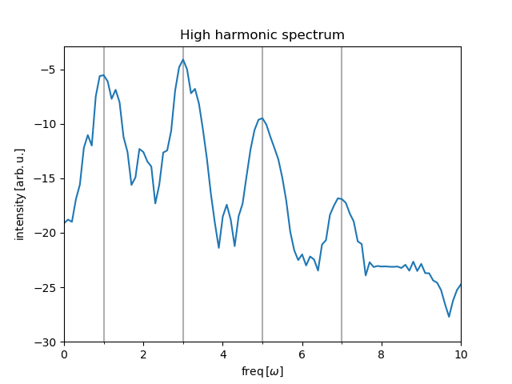
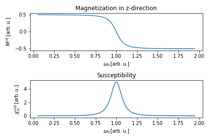

# __Lecture: Ultrafast dynamics__
Jupyter notebooks for the lecture using numerical concepts for propagtion of physical systems in time and calculation of eigenenergiesm and other expectation values.

## Recommended Packages:
All notebooks work with the following package-versions:
|Package    | Version   |
|---        |---        |
|python     |3.9        |
|numpy      |1.22.2     |
|scipy      |1.7.3      |
|matplotlib |3.3.4      |
|ipython    |7.30.1     |
|ipympl     |0.2.1      |

# Hydrogen Atom

# High Harmonic Generation (HHG)
Artificial one-dimensional atom of the form 
$$\hat{H} = \frac{1}{2}\hat{p}^2 + \hat{V}(\hat{x}) + E_0 \hat{x} f(t) \cos(\omega t),$$
where $f(t)$ is the envelope function of a $\sin^2$-laser pulse. We choose Dirichlet boundary conditions, $\psi(x_{\text{min}})=0$ und $\psi(x_{\text{max}})=0$.

# Two-Level System
Generic two-level system subjected to an external classical field is described via the hamiltonian
$$\hat{H}=\frac{\omega_0}{2} \hat{\sigma}_z + \frac{B_0}{2} \left\{ \hat{\sigma}_x \cos(\omega t) + \hat{\sigma}_y \sin(\omega t)\right\}.$$

Calculations of various expectation values like magnetization and susceptibility
$$M^{(z)} \sim \partial E / \partial \omega_0, \\ \chi_{\mathrm{m}}^{(zz)} \sim \partial^2 E / \partial \omega_0^2.$$