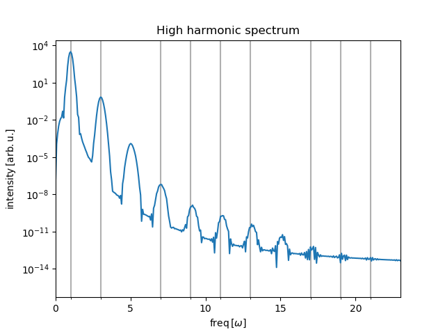

# __Lecture: Ultrafast dynamics__
Jupyter notebooks for the lecture using numerical concepts for propagtion of physical systems in time and calculation of eigenenergiesm and other expectation values.

## Required packages:
All notebooks are tested under the following package-versions:
|Package    | Version   |
|---        |---        |
|python     |3.9        |
|numpy      |1.22.2     |
|scipy      |1.7.3      |
|matplotlib |3.3.4      |
|ipython    |7.30.1     |
|ipympl     |0.2.1      |

# Hydrogen atom
Propagation of atomic wavefunctions using the [*Multiphoton-Matrix-Iterative-Method*](https://journals.aps.org/pra/pdf/10.1103/PhysRevA.60.3125) on non-uniform grids. We use atomic units. The Hamiltonian operator reads

$$ \hat{H}_0\Psi_{\ell}(r, t)Y_{\ell,m}(\theta,\varphi) = \left(-\frac{1}{2 r^2}\frac{\partial}{\partial r}\left(r^2 \frac{\partial}{\partial r} \Psi_{\ell}(r, t) \right) + \frac{\ell(\ell+1)}{2r^2}\Psi_{\ell}(r, t) - \frac{1}{r}\Psi_{\ell}(r, t)\right) Y_{\ell,m}(\theta,\varphi).$$

# High harmonic generation (HHG)
Artificial one-dimensional atom of the form 
$$\hat{H} = \frac{1}{2}\hat{p}^2 + \hat{V}(\hat{x}) + E_0 \hat{x} f(t) \cos(\omega t),$$
where $f(t)$ is the envelope function of a $\sin^2$-laser pulse. We choose Dirichlet boundary conditions, $\psi(x_{\text{min}})=0$ und $\psi(x_{\text{max}})=0$.

# Two-level system
Generic two-level system subjected to an external classical field is described via the Hamiltonian

$$\hat{H}=\frac{\omega_0}{2} \hat{\sigma}_z + \frac{B_0}{2} ( \hat{\sigma}_x \cos(\omega t) + \hat{\sigma}_y \sin(\omega t)).$$

Calculations of various expectation values like magnetization and susceptibility
$$M^{(z)} \sim \partial E / \partial \omega_0,$$
$$\chi_{\mathrm{m}}^{(zz)} \sim \partial^2 E / \partial \omega_0^2.$$
